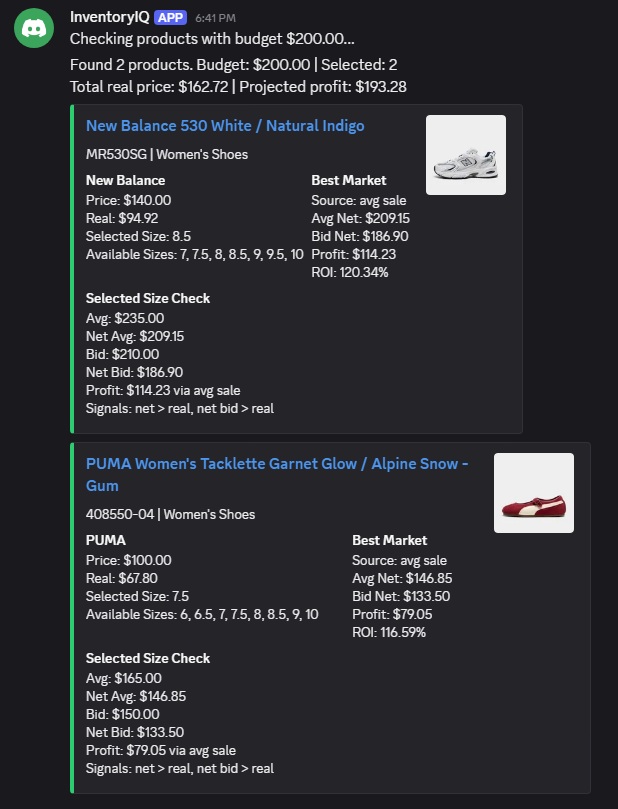
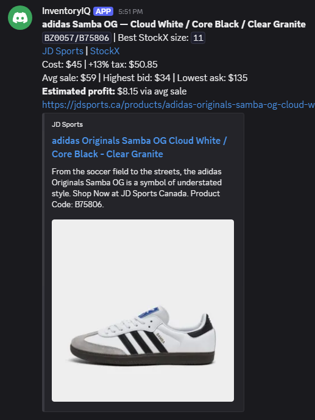
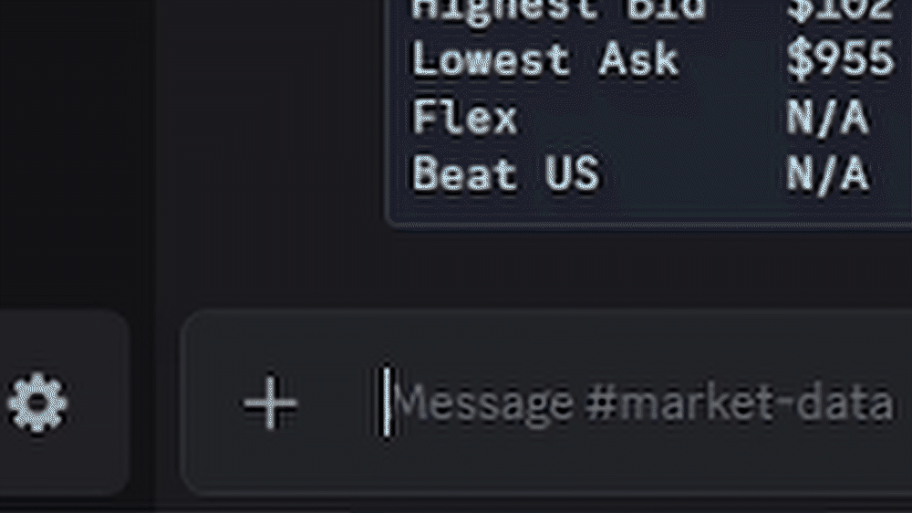

<h1 align="center">InventoryIQ</h1>

<p align="center">
  An inventory, pricing, and sales reconciliation system for a resale business,
  operated through Discord commands and Google Sheets. It finds profitable products at
  retail, tracks every unit as permanent inventory, and reconciles sales back from StockX.
</p>

<p align="center">
  
  
  
</p>

<p align="center">
  
</p>

Built and operated since 2023 for a real resale business (**1,000+ sales and $150K+ CAD in
transactions**) and deployed on two other operators' machines. This repository is the
public edition: the code is the real application, with the retailer, credentials and
business data replaced by synthetic values so it can be read and run anywhere.

The production deployment runs on AWS (ECS Fargate, RDS PostgreSQL) with Docker,
Terraform, and a GitHub Actions CI/CD pipeline. This public edition uses SQLite so it
runs anywhere without setup; the PostgreSQL support and infrastructure code are being
ported here and will be added soon.

---

## Try it in 60 seconds

No Discord server, API keys, or `.env` needed. The demo runs the core logic against
synthetic data and a temporary SQLite database.

```bash
git clone https://github.com/fnoorx/inventoryiq.git
cd inventoryiq
python -m venv .venv
.venv\Scripts\activate            # Windows (PowerShell: .venv\Scripts\Activate.ps1)
source .venv/bin/activate         # macOS/Linux
pip install -r requirements-dev.txt
python demo.py
python -m pytest -q
```

`demo.py` prints a catalogue diff (new products + price changes), a market estimate, and
then creates an inventory unit twice from the same message to show that the second call
returns the existing ID instead of allocating a new one.

---

## What it does

Discord is the operator interface. A typical day:

1. **Find deals.** `!scrape` diffs the retailer catalogue against the last snapshot and
   posts new products and price changes. `!check 30` prices every saved style against
   StockX assuming a 30% retail discount and posts the ones that clear the profit threshold.
2. **Buy within a budget.** `!launch 500` scrapes the retailer's launch page for sizes
   that are actually in stock, checks each size on StockX, and solves a 0/1 knapsack to
   pick the highest-profit set of items that fits $500.
3. **Log what arrived.** `!add`, or `!photo` with a picture of the box label. Each item
   gets a permanent `INV-000123` ID in SQLite and a row in the shared Google Sheet.
4. **Look things up.** Type a style code or `INV-` ID in the market channel for live
   StockX prices per size.
5. **Close the loop.** Every 3 hours (or on `sync`) the bot pulls payout-ready StockX
   orders, matches them to unsold Sheet rows by style and size, and marks them sold.

<p align="center">
  
  <br><sub><code>!launch 200</code>: the knapsack picks the two items whose combined real cost fits the budget with the highest projected profit.</sub>
</p>

---

## Engineering highlights

The parts worth reading, each linked to the file that implements it.

**Permanent inventory identities.** [`services/inventory_repository.py`](services/inventory_repository.py)
IDs come from an append-only SQLite sequence table guarded by triggers, so a number is
never reused. Creation is keyed by the Discord message that requested it: replaying the
same message returns the existing unit. 1,100+ historical Sheet rows were backfilled
through the same path with zero duplicate identities.

**A Sheet mirror that can fail without corrupting state.** [`services/inventory_service.py`](services/inventory_service.py)
SQLite commits first; the Sheet write is a second step that records `retry_pending` on
failure. `!inventoryretry` re-syncs by looking up the existing ID in the Sheet before
writing, so a retry can never allocate a second ID or append a duplicate row.

**A StockX client that survives real traffic.** [`services/stockx.py`](services/stockx.py)
One process-wide gate spaces every request (worker threads included), with separate
retry tiers for 401 (refresh the token once), 429 (honour `Retry-After`) and network
errors (3s/8s backoff). Style codes are matched exactly, including StockX's
slash-delimited combined styles, so a search never silently returns a related product.

**Photo intake with conflict detection.** [`services/label_intake.py`](services/label_intake.py) · [`services/label_preprocessing.py`](services/label_preprocessing.py) · [`services/barcode_decoder.py`](services/barcode_decoder.py)
A box-label photo is perspective-corrected with OpenCV, decoded with zxing-cpp, and read
by a vision model into a Pydantic schema. Evidence is ranked (decoded barcode, then
vision-read UPC, then printed style code) and every path cross-checks StockX's answer
against the label. Disagreement produces a `conflict` state for human review, never a
guess.

<p align="center">
  
  <br><sub><code>!check</code>: one card per profitable style: cost after tax, StockX market values, and the size that maximises profit.</sub>
</p>

**Launch scraper to profitability to knapsack.** [`services/launch/`](services/launch/)
Detail pages are fetched in parallel from the retailer's embedded Next.js state, filtered
to target sizes before any StockX call, market-checked once per unique style, then reduced
to one candidate per product so the 0/1 knapsack (integer cents, [`ranking.py`](services/launch/ranking.py))
can't recommend the same product twice. Product review went from ~15 minutes to ~3.

**Versioned schema with backwards-compatible migrations.** [`services/database_schema.py`](services/database_schema.py)
`PRAGMA user_version` tracks the schema; legacy databases on other operators' machines
upgrade in place (e.g. the ambiguous `cost` column became `price_paid` + `total_cost`).

**Offline test suite.** [`tests/`](tests/)
178 tests with a socket guard that fails any test attempting a real network call.
Integrations are exercised through injected fakes, including the ambiguous photo-intake
cases (barcode/label mismatch, multiple variants, unreadable sizes).

<p align="center">
  
  <br><sub>Market lookup: a style code and size typed into the channel; the reply is live StockX data for that exact variant.</sub>
</p>

---

## Commands

| Command | What it does |
|---|---|
| `!add <UPC> <price> [discount%]` | Add an item by scanning its box barcode; StockX resolves product and size. |
| `!add <location> <date> <style> <size> <price> [discount%]` | Add an item by style code. Price is pre-tax; `30%` applies a discount first. |
| `!photo [price]` + image | Research a box-label photo; buttons to add to inventory, see all sizes, edit, or cancel. |
| `!item INV-000123` | Show one unit: cost, location, status, Sheet row, sync state. |
| `!inventoryretry [INV-…]` | Re-sync units whose Sheet write failed. |
| `!backfillinventory CONFIRM` | Assign permanent IDs to existing Sheet rows; audits malformed and duplicate IDs. |
| `<style> [size]` or `INV-…` | Typed in the market channel: live StockX prices. Also `!market`. |
| `!scrape` | Diff the catalogue against the last snapshot; post new products and price changes. |
| `!check <discount%>` | Price every saved style against StockX and post the profitable ones. |
| `!brand [apparel\|footwear]` | Scan the brand's full public catalogue with Selenium and check profitability. |
| `!launch [budget]` | Scrape launch stock, check StockX, rank by ROI, or knapsack within a budget. |
| `sync` / `!sync` | Reconcile payout-ready StockX orders into the Sheet (also polled every 3 h). |

---

## Architecture

A single Python process. discord.py owns the event loop; every command handler hands
off to a synchronous service function in a worker thread, so slow HTTP, Selenium and
SQLite work never blocks Discord.

```
                          Operators (Discord)
                                  |
                     commands / messages / buttons
                                  |
 +--------------------------------v--------------------------------+
 |  bot.py         loads cogs, opt-in live startup                 |
 |  cogs/          one cog per channel: parse input, call one      |
 |                 service in a worker thread, format the reply    |
 +--------------------------------+--------------------------------+
                                  |  asyncio.to_thread
 +--------------------------------v--------------------------------+
 |  services/      all domain logic; external clients injected     |
 |                                                                 |
 |   inventory_service      pricing / sizes       launch/ knapsack |
 |   inventory_repository   scrape_catalogue      label_intake     |
 |   stockx client          catalogue_profit.     barcode / vision |
 |   stockx_order_sync      brand_catalogue       database_schema  |
 +-----+----------+----------+----------+----------+----------+----+
       |          |          |          |          |          |
    SQLite     Google     StockX    Retailer   Selenium    OpenAI
    (local)    Sheets     REST API  HTTP/JSON  + Chrome    vision
    IDs,       shared     market,   catalogue, brand-wide  box-label
    units,     ledger     GTIN,     launch     scan        read
    scans                 orders    stock
```

**Layers and the rules between them**

- `cogs/` never touch persistence or HTTP. They validate input, call exactly one
  service function, and render embeds or button views. Channel routing lives in
  [`utils/channels.py`](utils/channels.py).
- `services/` hold every decision the business depends on. External clients (Sheets,
  StockX, the scrapers, the vision model) are passed in as parameters, which is what
  lets the whole suite run offline against fakes.
- `utils/` are thin adapters: OAuth token cache for StockX, the gspread client, text
  and currency formatting.

**Data stores and what is authoritative**

| Store | Holds | Role |
|---|---|---|
| SQLite (`inventory_units`, `inventory_id_sequence`, `label_scans`) | Permanent `INV-` IDs, unit cost and status, sync state, photo-intake results | Source of truth. Schema versioned with `PRAGMA user_version`; migrations upgrade old databases in place. |
| Google Sheet (`Sales` worksheet) | One row per unit: cost, location, sale, payout | Shared ledger operators read and edit. Written second; failures are recorded as `retry_pending`, never allowed to mint a new ID. |
| JSON state files (`data/`) | Last seen retailer catalogue; processed StockX order numbers | Baseline for `!scrape` diffs; idempotency record for order sync. |

**The two write paths that matter**

1. *Inbound (buying).* `!add` / `!photo` resolve the product against StockX, insert the
   unit in SQLite inside one transaction keyed by the Discord message ID, then append
   the Sheet row. Replaying the message returns the existing unit.
2. *Outbound (selling).* `stockx_sync` polls payout-ready StockX orders on a timer,
   matches each to the first unsold Sheet row with the same style and size, marks it sold
   with payout details, and records the order so it is never applied twice.

**Deployment**

Production runs the same process as a Docker container on AWS ECS Fargate, with the
database on RDS PostgreSQL, secrets in Secrets Manager, and Terraform for the
infrastructure. A GitHub Actions pipeline runs the suite, builds the image, and applies
migrations before deploy. This edition swaps the database for a local SQLite file and
drops the infrastructure code so it runs with no setup; both are being ported over.

---

## Running it live

The bot only starts when you opt in, and it needs your own accounts:

```bash
cp .env.example .env    # then fill in the values below
python bot.py
```

| Setting | Needed for |
|---|---|
| `ENABLE_LIVE_INTEGRATIONS=true`, `DISCORD_TOKEN`, `*_CHANNEL_ID` | Starting the bot and routing each command to its channel |
| `STOCKX_*` | Market data, GTIN lookup, order sync (StockX developer API) |
| `SHEET_ID`, `GOOGLE_CREDS_*` | The inventory Sheet (service account, `Sales` worksheet) |
| `OPENAI_API_KEY` | Vision read of box labels in `!photo` |
| `PURCHASE_TAX_PERCENT`, `PURCHASE_DISCOUNT_PERCENT` | Cost assumptions; defaults are 13% tax, 0% discount |

`!brand` drives a real browser through Selenium, so it also needs Google Chrome installed
(Selenium Manager fetches the matching driver automatically). Everything else, including
the OpenCV / zxing-cpp photo pipeline, is covered by `requirements.txt`.

---

## About this edition

This is the public edition of a private application. The retailer integrations point at
`brand.example.test` / `catalogue.example.test`, product names and style codes in tests
and demos are fictional, and no credentials, databases, or business records are included.
The application logic, persistence layer, and tests are the real ones.

Licensed under [MIT](LICENSE).
