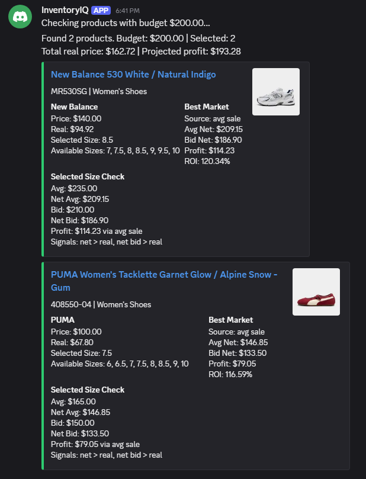
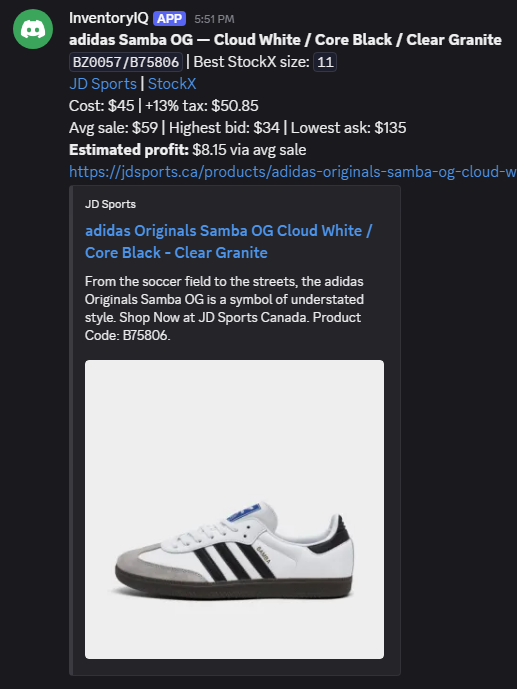
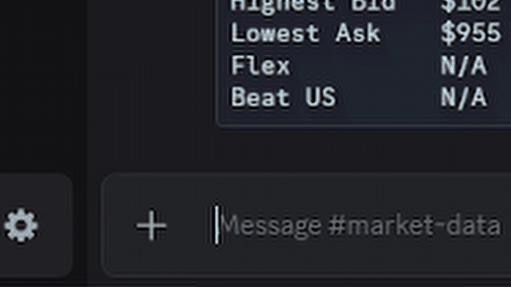

<h1 align="center">InventoryIQ</h1>

<p align="center">
  A Discord bot I built to run a real e-commerce business. It finds products worth buying,
  keeps track of every item in stock, and records sales automatically.
</p>

<p align="center">
  
  
  
</p>

<p align="center">
  
</p>

## Impact

- **Used in a real business since 2023:** over **1,000 sales** and **$150K+ CAD** in transactions.
- **Used by two other sellers** on their own computers, not just by me.
- **Cut launch product review from about 15 minutes to about 3.**
- **Moved 1,100+ existing spreadsheet rows** into the system with **zero duplicate IDs**.
- **Now runs on AWS**, so it no longer depends on my laptop being on.

This is the public version of the project. The code is the real code. I replaced the
store names, logins, and business data with made-up examples so anyone can read and run it.

---

## Try it in 60 seconds

You don't need Discord, API keys, or any setup. The demo runs the main logic on fake
data with a temporary database.

```bash
git clone https://github.com/fnoorx/inventoryiq.git
cd inventoryiq
python -m venv .venv
.venv\Scripts\activate            # Windows (PowerShell: .venv\Scripts\Activate.ps1)
source .venv/bin/activate         # macOS/Linux
pip install -r requirements-dev.txt
python demo.py
python -m pytest -q
```

The demo finds new products and price changes, estimates profit, and adds an item to
inventory. Then it tries to add the same item again, to show the bot never counts one
item twice.

---

## The problem

Running the business meant a lot of manual work: checking store websites for new
products, looking up what each one sells for, tracking every pair in a spreadsheet, and
marking items as sold. It was slow, and small mistakes (a duplicate row, a missed sale)
cost real money.

I built InventoryIQ so the team could do all of this from Discord in a few seconds.

## What it does

1. **Finds deals.** `!scrape` checks a store's catalogue and posts anything new or any
   price change. `!check 30` works out which products are profitable at 30% off.
2. **Picks what to buy on a budget.** `!launch 500` checks which sizes are in stock, looks
   up their market prices, and picks the most profitable set of items that fits in $500.
3. **Logs new stock.** `!add` or a photo of the box label. Every item gets a permanent ID
   like `INV-000123` and a row in the team's Google Sheet.
4. **Looks up prices.** Type a style code to see live StockX prices for every size.
5. **Records sales automatically.** Every 3 hours the bot pulls finished StockX sales,
   finds the matching item in the Sheet, and marks it as sold.

<p align="center">
  
  <br><sub><code>!launch 200</code>: the bot picks the two items with the highest profit that fit in a $200 budget.</sub>
</p>

---

## What I'm proud of

**No item is ever counted twice.** Each item gets a permanent ID that is never reused.
If Discord sends the same command twice, or two people add something at the same time,
the bot returns the item that already exists instead of making a copy.
([`inventory_repository.py`](services/inventory_repository.py))

**The spreadsheet can fail without losing data.** The database is the source of truth and
saves first. If Google Sheets is down, the item is marked to retry later, and the retry
can't create a duplicate row. ([`inventory_service.py`](services/inventory_service.py))

**It reads box labels from a photo.** It straightens the photo, scans the barcode, and
uses an AI vision model to read the label. Then it checks every answer against StockX.
If the barcode and the label disagree, it asks a person instead of guessing.
([`label_intake.py`](services/label_intake.py))

<p align="center">
  
  <br><sub><code>!check</code>: one card per profitable product, with cost after tax, market prices, and the best size to buy.</sub>
</p>

**It handles StockX's limits.** All requests go through one shared rate limiter, with
automatic retries when a login token expires or the API says to slow down.
([`stockx.py`](services/stockx.py))

**Budget picking is a real algorithm.** Choosing the best items within a budget is the
classic "knapsack" problem. I solve it with exact money math (in cents), and it never
recommends the same product twice. ([`ranking.py`](services/launch/ranking.py))

**It's well tested.** 280 automated tests, and they can't touch the internet: any test that
tries to make a real network call fails. That means the whole suite runs anywhere, for free.
([`tests/`](tests/))

<p align="center">
  
  <br><sub>Price lookup: type a style code and size, and the bot replies with live StockX prices.</sub>
</p>

---

## Moving it to the cloud (AWS)

At first the bot only worked while my laptop was on. I moved it to AWS so it runs on
its own, and used the move to learn how real production systems are set up.

- **Docker** packages the bot so it runs the same way on my laptop and in the cloud.
- **ECS Fargate** runs the bot without me managing a server.
- **RDS PostgreSQL** replaced the local database file. It's private (not reachable from
  the internet) and backed up automatically every day.
- **Secrets Manager** holds every password and API key. None of them are in the code,
  and the database password can change without restarting the bot.
- **Terraform** describes all of the infrastructure as code, so it's easy to review and
  rebuild. ([`infra/aws/`](infra/aws/))
- **Alembic** manages database changes, and I wrote a tool that copies all the data
  between the old and new database and checks that every record matches.

A few decisions I made on purpose:

- **Only one bot runs at a time.** During an update, the old bot stops before the new
  one starts, so two copies can never edit the inventory at once.
- **It's cheap to run.** No load balancer or extra networking that the bot doesn't need.
- **It's easy to undo.** Every version is kept, so going back is a one-line change. The
  bot can also move back to running locally without losing data.

You can still run everything locally with SQLite and no AWS account. The full setup
guide is in [DEPLOYMENT.md](infra/aws/production/DEPLOYMENT.md).

---

## How it's built

```
                          Discord (the team)
                                  |
 +--------------------------------v--------------------------------+
 |  bot.py         starts the bot                                  |
 |  cogs/          one file per Discord channel: reads the         |
 |                 command and calls one service                   |
 +--------------------------------+--------------------------------+
                                  |
 +--------------------------------v--------------------------------+
 |  services/      all the business logic                          |
 +-----+----------+----------+----------+----------+----------+----+
       |          |          |          |          |          |
    SQLite /   Google     StockX     Store      Chrome      OpenAI
    Postgres   Sheets     API        websites   (Selenium)  vision
```

- **`cogs/`** only handle Discord: read the command, call one service, send the reply.
- **`services/`** hold all the real logic. Outside tools (Sheets, StockX, the AI model)
  are passed in, so tests can swap them for fakes.
- Slow work runs in the background, so Discord never freezes.

**Tech:** Python, discord.py, SQLAlchemy, PostgreSQL, SQLite, Alembic, Docker, AWS (ECS
Fargate, RDS, Secrets Manager, S3, CloudWatch), Terraform, Selenium, OpenCV, OpenAI,
Google Sheets API, StockX API, pytest.

---

## Commands

| Command | What it does |
|---|---|
| `!add <UPC> <price> [discount%]` | Add an item by scanning its barcode. |
| `!add <location> <date> <style> <size> <price> [discount%]` | Add an item by style code. `30%` takes 30% off first. |
| `!photo [price]` + image | Read a box-label photo, then add it, edit it, or cancel. |
| `!item INV-000123` | Show one item: cost, location, status, and Sheet row. |
| `!inventoryretry [INV-…]` | Retry items that didn't save to the Sheet. |
| `!backfillinventory CONFIRM` | Give permanent IDs to rows already in the Sheet. |
| `<style> [size]` or `INV-…` | In the market channel: live StockX prices. Also `!market`. |
| `!scrape` | Post new products and price changes from the store catalogue. |
| `!check <discount%>` | Post every saved product that's profitable at that discount. |
| `!brand [apparel\|footwear]` | Scan the brand's full catalogue in a real browser and check profit. |
| `!launch [budget]` | Rank in-stock launch items by profit, or pick the best set for a budget. |
| `sync` / `!sync` | Mark finished StockX sales as sold in the Sheet (also runs every 3 hours). |

---

## Running it live

The bot only connects to real accounts if you turn that on, and it needs your own keys:

```bash
cp .env.example .env    # then fill in the values below
python bot.py
```

| Setting | What it's for |
|---|---|
| `ENABLE_LIVE_INTEGRATIONS=true`, `DISCORD_TOKEN`, `*_CHANNEL_ID` | Starting the bot and choosing a channel for each command |
| `STOCKX_*` | Prices, barcode lookups, and sales (StockX developer API) |
| `SHEET_ID`, `GOOGLE_CREDS_*` | The inventory Google Sheet |
| `OPENAI_API_KEY` | Reading box-label photos |
| `PURCHASE_TAX_PERCENT`, `PURCHASE_DISCOUNT_PERCENT` | Cost settings (default: 13% tax, no discount) |
| `DATABASE_URL` (optional) | Use PostgreSQL instead of the local SQLite file. `compose.yaml` starts one, then run `alembic upgrade head`. |

`!brand` uses a real Chrome browser, so Google Chrome needs to be installed.

---

## About this version

This is the public version of a private project. Store websites point to
`brand.example.test` and `catalogue.example.test`, and the products, codes, and barcodes in
the tests and demo are made-up examples. No passwords, databases, or business records are included.

Licensed under [MIT](LICENSE).
